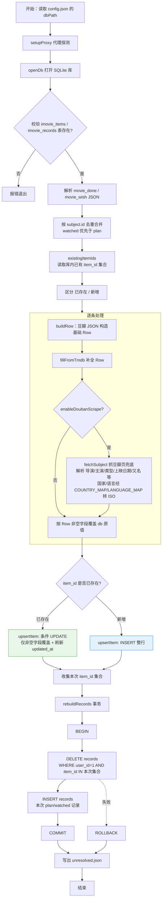

# 豆瓣导出 JSON → iMOVIE SQLite 同步工具

将豆瓣导出的观影数据（`movie_done.json` 已看 / `movie_wish.json` 想看）**直接同步**到 iMOVIE 的
SQLite 数据库（`imovie_items` + `imovie_records` 两张表）。脚本通过 `config.json` 中的 `dbPath`
指定目标库，利用 `@libsql/client`（Turso/libSQL）以本地文件（`file:` 协议）直接读写 `.db` 文件，
无需生成中间 SQL 文件。

## 同步逻辑

1. 读取 JSON，按 `subject.id`（即 `item_id`）与库内 `imovie_items` 比对，区分「已存在 / 新增」。
2. **已存在**：先经 TMDb（及可选豆瓣影片页）补全得到完整 `Row`，仅用 `Row` 中**非空字段**覆盖
   库内对应列，空字段保留库内原值（不更新）。
3. **新增**：将补全后的 `Row` 直接 `INSERT`。
4. **`imovie_records`**：事务内先 `DELETE` 本次 JSON 涉及的 `item_id`（仅当前用户 `user_id=1`），
   再全量重插 plan/watched 记录，**保留库内其他历史记录**。
5. TMDb 未匹配到的条目仍按豆瓣已有字段入库，并写入 `unresolved.json` 供人工补全。

## 流程图



## 目录文件

| 文件 | 说明 |
|------|------|
| `movie_done.json` | 豆瓣导出的「已看」数据 |
| `movie_wish.json` | 豆瓣导出的「想看」数据 |
| `config.json` | 工具配置文件（含 `dbPath` 指向目标库） |
| `2-douban_import.ts` | 主脚本（TypeScript，用 `tsx` 运行） |
| `unresolved.json` | TMDb 查不到的影片清单（运行产物） |
| `test/sync.test.ts` | 单元测试（`node --test` 运行，26 用例） |
| `test/REPORT_*.md` | 测试报告 |
| `README.md` | 本说明 |

## 快速使用

1. 在 `config.json` 中设置：
   - `dbPath`：目标 SQLite 库文件路径（相对脚本目录）。
   - `tmdbApiKey`：真实 TMDb Key。
   - `doubanCookie`：豆瓣影片页抓取用 Cookie（兜底补全）。
2. 先用小批量试跑，确认无误：
   ```powershell
   # 编辑 config.json 把 limit 改为 5
   cd f:\static\imovie_admin
   npx tsx 2-douban_import.ts
   ```
3. 确认日志输出（`覆盖更新 / 新增插入 / records 重建` 条数）无误后，把 `limit` 改回 `0`（不限制）跑全量。
4. 运行单元测试：
   ```powershell
   cd f:\static\imovie_admin
   $env:NODE_ENV="test"; node --import tsx --test test/sync.test.ts
   ```

> 要求：Node.js 18+（使用内置 `fetch`）、`@libsql/client` 与 `tsx`。本地文件模式读写 `.db` 无需联网 Token。

## 配置项（config.json）

| 字段 | 默认值 | 说明 |
|------|--------|------|
| `dbPath` | — | **目标 SQLite 库路径**（相对脚本目录），同步直接读写此库 |
| `jsonDir` | `.` | JSON 数据文件所在目录（相对本配置目录） |
| `doneFile` | `movie_done.json` | 已看数据文件名 |
| `wishFile` | `movie_wish.json` | 想看数据文件名 |
| `limit` | `0` | 每个文件限制导入条数，`0` = 不限制 |
| `unresolvedFile` | `unresolved.json` | 未匹配清单文件名 |
| `tmdbApiKey` | — | TMDb API Key（必填，否则全部进入 unresolved） |
| `tmdbBaseUrl` | `https://api.themoviedb.org/3` | TMDb API 地址 |
| `tmdbDelayMs` | `50` | 每次 TMDb 请求的间隔（毫秒），避免限速 |
| `enableTmdb` | `true` | 是否启用 TMDb 补全 |
| `proxy` | — | HTTP 代理地址（抓取豆瓣页 / TMDb 失败时回退） |
| `doubanCookie` | — | 豆瓣影片页抓取用 Cookie（兜底补全导演/主演/类型/上映日期等） |
| `scrapeDelayMs` | `2000` | 每条豆瓣页面抓取后的停顿（毫秒） |
| `scrapeLimit` | `0` | 豆瓣页抓取限制条数，`0` = 不限制 |

## 字段映射

### imovie_items（影片元数据）

| 列 | 来源 |
|----|------|
| `item_id` | 豆瓣 `subject.id` 转字符串（主键） |
| `media_type` | `subject.type/subtype`：`tv`→`tv`，其余→`movie` |
| `title` | `subject.title` |
| `original_title` | TMDb 补全 |
| `year` | `parseInt(subject.year)`，空/非数字→`NULL` |
| `poster_path` | TMDb 补全 |
| `overview` | TMDb 补全（换行折叠为单行），豆瓣页兜底 |
| `director` | `subject.directors` 用 ` / ` 拼接，豆瓣页兜底 |
| `writer` | TMDb 补全（credits.Writing / tv.created_by） |
| `cast` | `subject.actors` 用 ` / ` 拼接，豆瓣页兜底 |
| `genres` | `subject.genres` 用 ` / ` 拼接，豆瓣页兜底 |
| `country` | TMDb `origin_country` 首位；或豆瓣「制片国家/地区」经 `COUNTRY_MAP` 中文→ISO 兜底 |
| `language` | TMDb `original_language`；或豆瓣「语言」经 `LANGUAGE_MAP` 中文→ISO 兜底 |
| `release_date` | 豆瓣 `pubdate[0]` 日期部分（支持 `2026-08-11` / `2026年8月11日` 等），TMDb `release_date` 兜底 |
| `runtime` | TMDb 补全，豆瓣页「片长」兜底 |
| `aka` | 豆瓣页「又名」解析（`更多...` 尾缀去除） |
| `imdb_id` | TMDb 补全；或豆瓣页解析（`tt` 号）兜底 |
| `douban_id` | `subject.id` 转字符串（与 item_id 同值） |
| `tmdb_id` | TMDb 补全 |
| `douban_rating` | `subject.rating.value`（豆瓣评分，满分 10） |
| `tmdb_rating` | TMDb 补全（`vote_average` 四舍五入 1 位） |
| `updated_at` | `datetime('now')` |

### imovie_records（观影记录）

| 列 | 来源 |
|----|------|
| `user_id` | 固定 `1` |
| `item_id` | `subject.id`（与 items 关联） |
| `status` | `movie_done.json`→`watched`，`movie_wish.json`→`plan` |
| `rating` | 根级用户评分（满分 5）×2 映射到 1–10，超出区间钳制、无评分→`NULL` |
| `tags` | 默认 = `genres`；TMDb 关键词（keywords）合并去重后追加 |
| `watched_at` | 仅 `watched` 有值，取自 `create_time` 的日期部分 |
| `created_at` | `datetime('now')`（首次导入时间，更新时不刷新） |

## TMDb 补全逻辑

豆瓣 JSON 中缺失的字段（`poster_path / imdb_id / tmdb_id / tmdb_rating / original_title /
overview / country / language / runtime / writer`）全部通过 TMDb 补全：

1. 按 `title` + `year` 调用 `search/{movie|tv}`，取第一条结果得到 `tmdb_id`、
   `poster_path`、`vote_average`、`original_title`。
2. 再用 `tmdb_id` 调用 `/{movie|tv}/{id}`（含 `credits`、`alternative_titles`、`keywords`）
   补全其余细节字段与别名、关键词。
3. 两条请求都失败或拿不到 `tmdb_id`，则该条目写入 `unresolved.json`
   （含 `item_id`、`title`、`media_type`），对应字段在库中保持 `NULL`，供人工处理。

## 数据库同步策略（UPSERT）

- `imovie_items`：
  - 库内**不存在** `item_id` → 直接 `INSERT`。
  - 库内**已存在** → `UPDATE` 仅覆盖 `Row` 中**非空字段**（含 `updated_at` 刷新）；
    空字段保留库内原值，不会因本次 JSON 缺字段而被清空（数值 `0` 视为有值会覆盖）。
- `imovie_records`：事务内 `DELETE FROM imovie_records WHERE user_id=1 AND item_id IN (本次 item_id 集合)`，
  再全量 `INSERT` 本次的 plan/watched 记录。仅影响本次同步批次，**保留其他历史记录**。

## 豆瓣影片页兜底

当开启豆瓣页抓取时（`enableDoubanScrape` 默认 true，需配置 `doubanCookie`），每条影片在 TMDb 补全后
还会抓取豆瓣影片页（`https://movie.douban.com/subject/{item_id}`），解析并补全 TMDb 未覆盖的字段：
`director`（导演）、`cast`（主演）、`genres`（类型）、`release_date`（上映日期）、
`writer`/`country`/`language`/`runtime`/`aka`/`overview`/`imdb_id`。
其中 `country`/`language` 的中文值会经 `COUNTRY_MAP` / `LANGUAGE_MAP` 转换为 ISO 码。
同样遵循「非空才覆盖」原则。

## 单元测试

`test/sync.test.ts` 使用 Node.js 内置 `node:test`，对核心逻辑做隔离验证（TMDb / 豆瓣抓取用 mock fetch，
不实际联网）。覆盖：

- `hasVal`（非空判断）
- `existingItemIds`（库内主键集合）
- `upsertItem`（新增 INSERT / 已存在条件 UPDATE / overview 换行折叠 / 数值 0 视为有值覆盖）
- `rebuildRecords`（事务重建 / 不破坏其他 `user_id` 记录 / 空 `item_id` 跳过）
- `buildRow`（watched/plan 映射、评分钳制、tv 判定、日期归一化、item_id/douban_id 字符串化）
- `parseSubjectPage`（完整解析 / all hidden 简介回退 / 裸 IMDb 号回退 / 片长取首个数字 / 又名去尾缀）
- `fillFromTmdb`（成功补全 / 搜索无结果 / 网络异常 / 详情失败容错）
- `fillFromDoubanPage`（仅补全空字段、已有值不覆盖 / 抓取失败不抛出）
- 列常量完整性

运行：`$env:NODE_ENV="test"; node --import tsx --test test/sync.test.ts` → 当前 **26/26 通过**。

## 注意事项

- 未配置有效 TMDb Key 时，所有条目都会进入 `unresolved.json`（但仍按豆瓣 JSON 字段入库，缺失字段为 `NULL`）。
- 启用豆瓣页抓取需配置 `doubanCookie`，且每条会额外请求一次豆瓣页面（受 `scrapeDelayMs` 限速）。
- `dbPath` 指向的库必须已存在且含 `imovie_items` / `imovie_records` 两张表，否则脚本启动即报错。
- `limit` / `scrapeLimit` 分别对两个文件/抓取生效（如 `limit=5` 即各取 5 条，共 10 条）。
- 全量约 3900 条，配合 TMDb 与豆瓣抓取限速可能耗时较长，建议先用 `limit` 试跑。
